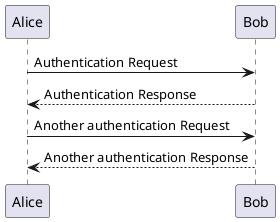

# Content Guide

The following inputs are combined to create a document:

* Document text.
* Images.
* Diagrams generated from PlantUML text files.

This guide describes the possibilities for content authoring available with each type of input.

# Authoring document text

The main contents of a document are in a Bikeshed file with the extension `.bs.md`.

The format of the document is a mixture of HTML and Markdown plus some custom elements defined by the Bikeshed document format for describing metadata and data type definitions.

In general, use Markdown for text authoring whenever possible. Some features (e.g. images and tables) require you to use HTML. Defining data structures will require you to use specialized Bikeshed syntax to ensure proper referencing behavior.

More detailed guidance on common scenarios follows below.

# Using HTML

HTML will technically work but you should avoid it unless you truly need it. Prefer Markdown.

# Basic Markdown formatting

Textual content of the document uses Markdown for formatting. See [Markdown Reference](https://commonmark.org/help/) for examples.

Various Bikeshed extensions are added to the Markdown language. You can read about the details in the [Bikeshed reference](https://tabatkins.github.io/bikeshed/#markup-shortcuts).

NB! Not all Markdown features are supported (e.g. you cannot embed images with Markdown).

# Headings and references

To uniquely identify a heading for referencing purposes, you must explicitly add an anchor. The anchor is the `{#xyz}` tag at the end of the heading.

```text
## Powering machine learning with XML 1.0 ## {#powering-ml-with-xml}
```

Use the anchor to reference the heading elsewhere in the text. The link will automatically be replaced with the heading text.

```text
VR solutions often benefit from XML-enabled machine learning,
as described in the [[#powering-ml-with-xml]] chapter.
```

**Always add an anchor to every heading**, even those you do not currently reference - other people might want to link to them later!

# Inserting images

Use HTML to insert images. The recommended format is:

```html
<figure>
	
	<figcaption>Example of workflow for Live Content preparation.</figcaption>
</figure>
```

You must place all images in the `Images/` directory (subdirectories are allowed).

# Inserting links to websites

Use Markdown link syntax for links to the web.

```markdown
[Click here for an adventure](https://zombo.com)
```

# Tables

Use HTML for tables.

```html
<!-- class=def is a builtin style that makes for nice looking tables -->
<table class="def">
	<tr>
		<th>Usage</th>
		<th>Algorithm</th>
	</tr>
	<tr>
		<td>Content Key wrapping</td>
		<td>AES256-CBC, PKCS #7 padding</td>
	</tr>
	<tr>
		<td>Encrypted key MAC</td>
		<td>HMAC-SHA512</td>
	</tr>
</table>
```

# Highlighting notes

Paragraphs starting with `Note: ` will be highlighted in the output document.

```
Note: Bees can fly up to two miles to find nectar and pollen.
```

For additional information about special block formatting that applies in this and similar scenarios, see the [Bikeshed documentation](https://tabatkins.github.io/bikeshed/#notes-etc).

# References to external documents

You can directly reference any document listed in the [SpecRef catalog](https://specref.org) using `[[!rfc7168]]` (normative) and `[[rfc2324]]` (informative) tags in text. Such tags will be replaced with a suitable hyperlink during document compilation and, if the reference is normative, the referenced document will be added to the bibliography section.

To add custom bibliography entries, define a `<pre class=biblio>` section containing SpecRef style JSON. This will be simply be appended to any SpecRef data set when building your document.

Example of the bibliography data format:

```json
{
  "rfc2324": {
    "href": "https://tools.ietf.org/html/rfc2324",
    "title": "Hyper Text Coffee Pot Control Protocol (HTCPCP/1.0)",
    "authors": [
      "L. Masinter"
    ],
    "status": "Informational",
    "publisher": "IETF",
    "id": "rfc2324",
    "date": "1 April 1998"
  },
  "rfc7168": {
    "href": "https://tools.ietf.org/html/rfc7168",
    "title": "The Hyper Text Coffee Pot Control Protocol for Tea Efflux Appliances (HTCPCP-TEA)",
    "authors": [
      "I. Nazar"
    ],
    "status": "Informational",
    "publisher": "IETF",
    "id": "rfc7168",
    "date": "1 April 2014"
  }
}
```

[SpecRef accepts contributions](https://github.com/tobie/specref#updating--adding-new-references), If you do not find a document in the catalog, consider adding it to SpecRef instead of maintaining a custom bibliography section.

# Code blocks

Use `<xmp>` for code blocks. Contents of this element are interpreted as plain text, with no need for any escaping of special characters.

For syntax highlighting, specify the language with `<xmp highlight="xml">`.

To add line numbers, specify `<xmp line-numbers>`.

# Embedding diagrams

You are recommended to generate diagrams from text files, as they enable an easier editing and review experience than images. This document authoring workflow supports diagram generation from [PlantUML files](http://plantuml.com/).

Diagram files have the `.wsd` extension. All diagrams must be placed in the `Diagrams/` directory (subdirectories are allowed).

At document build time, a `.png` file is generated for each diagram. Simply use this file as you would any other image (except for the fact that these are in the `Diagrams/` directory).

See the [PlantUML documentation](http://plantuml.com/) for syntax examples - it is a very flexible language and supports many diagramming features. A very basic example is given below.

## Example: sequence diagram

A `Diagrams/SequenceDiagram.wsd` file with the following content will produce the below image as `Diagrams/SequenceDiagram.png`.




# Restrictions on Bikeshed capabilities

Due to process limitations it is not possible to include code blocks (or other content) from standalone files, even though the [Bikeshed documentation does define an "include" feature](https://tabatkins.github.io/bikeshed/#including) for this purpose. You must embed all your textual content directly in the main Bikeshed document.

# Compiling the document

Changes made in the document owner's repository and its pull requests automatically trigger a build process that generates and publishes the updated output documents on the web and links them in pull request comments.

Local document compilation is also relatively straightforward. The system requirements for local compilation are:

* Windows 10 or a recent Linux distribution with a graphical user interface
* Java
* (Linux only) [PowerShell Core](https://docs.microsoft.com/en-us/powershell/scripting/setup/installing-powershell-core-on-linux?view=powershell-6)
* (Linux only) wkhtmltopdf
* (Linux only) graphviz

All of the commands below are to be executed in a PowerShell console (`pwsh` on Linux).

To install the compiler, execute `Install-Module BikeshedDocumentAuthoring`. You can later update it with `Update-Module BikeshedDocumentAuthoring`. Specify the `-Scope CurrentUser` argument if you do not wish to create a system-wide installation.

To compile the document:

1. Navigate to the directory that contains the document
1. Execute `Import-Module BikeshedDocumentAuthoring`
1. Execute `Invoke-DocumentCompiler`

After successful compilation, the output will be in an `Output/` subdirectory.