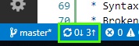
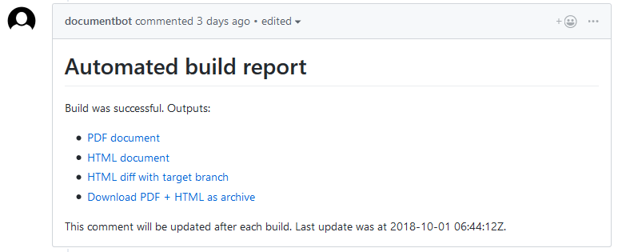
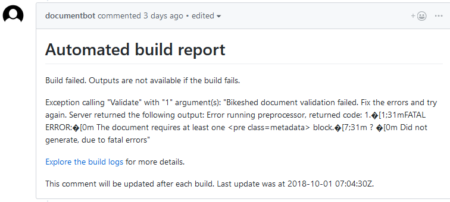
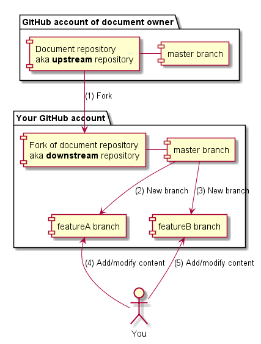
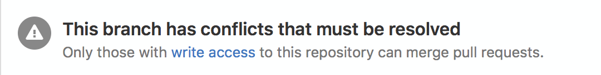

[Back to table of contents](README.md)

Join **#document-authoring** on Slack: 

# Contributor Guide

This guide walks you through the steps needed to contribute new content or changes to a document.

GitHub is used as the service that organizes and synchronizes work by multiple contributors and editors. You will need to familiarize yourself with GitHub and Git working processes.

This guide only presents a high level overview. You are expected to explore [GitHub Help](https://help.github.com/) to learn the details of any Git operations that are unfamiliar to you.

# Initial state

There exists a GitHub repository in the document owner's GitHub account. The master branch of this repository contains all the files used to generate the document.

Your contribution will become a part of the document when it is present in this master branch. The workflow described on this page is designed to make that happen.

# Your contribution goes into a fork

A fork is a personal copy of a repository. Create a fork on GitHub to start the contributing process.

Change the contents of the master branch of your fork to reflect your contribution and commit the changes into the downstream repository.

# You can work either online or offline

The GitHub website enables you to perform basic editing online, without the need for any software installation or manual Git operation. The downside is that the editor functionality is very limited.

While various GUIs for working with Git exist, none of them can be said to be intuitive or particularly user-friendly. If you are not comfortable using Git commands from the command line, you are recommended to use the online editor where possible.

To work offline you must clone your fork onto your workstation. This creates a copy that must later be explicitly synchronized with the copy in GitHub using Git commands.

After cloning, perform any desired edits, commit the changes and perform a Git push to copy the committed changes to the online repository. A Git pull is a related operation - perform a pull to copy any online changes to the offline clone.

In Visual Studio Code, there is a Sync button on the status bar. Click this button to perform both a pull and a push, synchronizing your offline and online copies in both directions. The screenshot above shows the sync button, with labels indicating 0 commits waiting to be pulled from the fork and 3 commits waiting to be pushed to the fork.

# Submit a pull request when ready

Once you have adjusted the contents of your fork to include your contribution, [submit a Pull Request](https://help.github.com/articles/creating-a-pull-request-from-a-fork/) in the document owner's repository. In the pull request, reference the upstream repository as "base" and the downstream repository as "head".

A pull request is a request for the editors of the document to review your contribution and merge it into the upstream repository. Give your pull request a good description that outlines what it is supposed to be and provides the editors any background information they might need to properly review your contribution (e.g. links to related GitHub issues).

You will likely receive comments and requests for changes from the editors. Use GitHub comments for discussion and submit new commits in your fork to make any desired changes. Any changes you make in your fork are immediately reflected in the pull request - there is no need for any action to submit updates.

It is good practice to leave a comment on the pull request after completing a round of updates. This clearly signals to editors that the contribution is ready for the next review round.

Submitting a pull request triggers an automated build of the document. Once the build has completed, links to generated output files will be posted in the pull request comments.

# Oh no, the build failed!

If a build failure is reported investigate the build logs and take corrective action. A new build will automatically be queued when the fix has been submitted into your fork.

Common reasons for build failures are:

* Syntax errors in document markup.
* Broken links.

# How to see the output before the contribution is ready?

The repository only contains the source code of the document and not the final PDF and HTML output. For any non-trivial changes, you will want to verify that the formatting looks good and that there are no broken links.

There are two methods for seeing the output of your contribution during authoring:

1. Install the document compiler on your workstation and invoke the build process. Refer to the [environment setup instructions](Content.md) for details on setting up and invoking the compiler.
1. Create a pull request even before your contribution is ready. Upon pull request creation or update, an automated build process will generate the outputs and post links in the pull request comments. **Mark the pull request as work in progress in the pull request description**, so it does not get prematurely reviewed or rejected!

# How do I create multiple independent contributions?

Instead of committing your changes into the `master` branch in your fork, [create separate branches](https://help.github.com/articles/creating-and-deleting-branches-within-your-repository/) for each contribution.

If you work with an offline clone of your fork, all operations are performed on the currently active branch (of which there can be only one). The operation of switching from one active branch to another is called `checkout`. The default active branch is `master`.

In the Visual Studio Code GUI, the current branch is displayed at the bottom-left corner of the status bar.

# What if the upstream repository changes?

**Your fork does not automatically receive updates made to the upstream repository.**

If your contribution provides only non-conflicting changes, it can be merged by an editor immediately after review even if your fork lacks the latest updates.

If GitHub says that your contribution conflicts with new changes made to the upstream repository then you will need to [merge changes from upstream](https://help.github.com/articles/merging-an-upstream-repository-into-your-fork/) and create a new commit that [resolves any merge conflicts](https://help.github.com/articles/addressing-merge-conflicts/) before the contribution can be accepted.

NB! Merging changes from upstream requires the use of an offline clone. This operation cannot be performed online in the GitHub web interface.

If you use Visual Studio Code as your editor, it will provide some text highlighting to assist in merging conflicting changes but overall resolving merge conflicts it is a manual process.

If during merging, you are notified of conflicts, you should follow these steps to resolve them in each file with conflicts:

1. Open the file and find the conflicts. There will be lines with arrows to indicate conflicting blocks, as on the screenshot above.
1. Decide how to merge the two conflicting versions of the same section.
1. Edit the document to replace the marked text with whatever you consider correct (delete the arrows and any unwanted text).
1. Repeat for all other conflicts in this file.
1. Stage the file by pressing the associated "plus" button in the Visual Studio Code source control sidebar. This marks it as ready to be committed.
1. Repeat for all other files with conflicts.
1. Once all files are processed, commit the merge and push the commit into your fork.

Merging conflicting changes can be difficult - ask for help in the Slack channel if you get into trouble!

# What do I do once my pull request has been merged?

You can safely delete your fork.

If you use multiple branches in your fork to work on multiple contributions in parallel, just delete the relevant branch.

# Advanced Git usage

This guide provides a simple workflow designed to make the process easy for contributors that are not very familiar with Git workflows. If you are an experienced Git user then feel free to deviate from the above instructions and use advanced Git features not mentioned here.