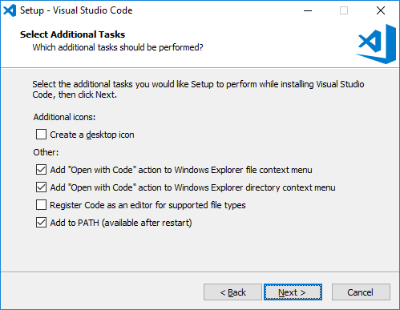
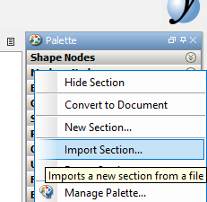
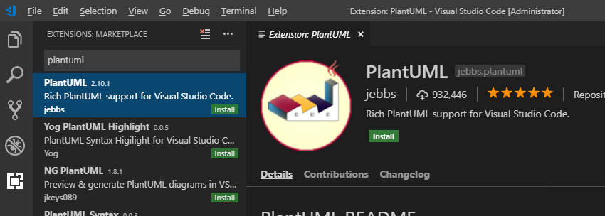
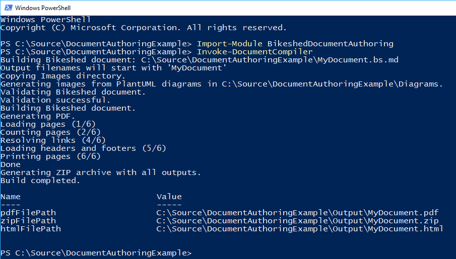

[Back to table of contents](README.md)

Join **#document-authoring** on Slack: 

# Local environment setup

Follow the instructions on this page to set up a complete local installation of the document authoring tools.

Simple editing operations may also be possible online on GitHub, without any local installation.

Advanced users are free to deviate from these instructions if they have familiar alternatives that can fulfill the same goals.

# Prerequisites

You need one of the following operating systems:

* Windows 10
* Recent version of your preferred Linux distribution with a desktop environment

MacOS compatibility is unknown but theoretically likely. Please report any success or failure in Slack if you try macOS!

You must have administrator-level access to the system (or ask someone with such an access level to perform the setup).

# Overview

The following software will be installed:

* Visual Studio Code - this is the preferred text editor for document authoring.
* PlantUML plugin for Visual Studio Code - a sequence/component diagram generator.
* yEd - a boxes-and-arrows diagram editor.
* DASH-IF PowerShell module for document authoring - generates the final output documents.
* Git - for synchronizing local files with GitHub repositories.
* Java - a prerequisite for several of the above apps.
* Graphviz - a prerequisite for PlantUML.
* wkhtmltopdf - a prerequisite for the document compiler.

The following chapters guide you through setting up all of this. You may need to slightly deviate from these instructions if your working environment is unusual. Join **#document-authoring** on Slack for live assistance: 

# Install Java

Java is a prerequisite of various parts of the workflow.

If you already have Java installed, skip this chapter. You can test by executing `java -version` in a terminal window. If this command succeeds and shows a version string, you already have Java.

On Windows, the preferred version of Java is OpenJDK 11.

1. [Download the latest version 11 .MSI file](https://github.com/ojdkbuild/ojdkbuild/releases) (the filename should be similar to `java-11-openjdk-11.0.1.13-1.ojdkbuild.windows.x86_64.msi`).
1. Execute this MSI file and follow the displayed instructions to finish installing Java.
    1. If you get a SmartScreen warning popup, click "More Info" and "Run anyway" to bypass it.
    1. Leave all the options in the installer at their default values.
1. Open a new terminal window and verify that the `java -version` command succeeds.

If using Linux, contact your Linux distribution vendor for instructions on installing Java.

# Install Graphviz

Graphviz is a prerequisite for PlantUML.

On Windows:

1. [Download the Graphviz 2.38 .MSI file](https://graphviz.gitlab.io/_pages/Download/Download_windows.html).
1. Execute the .MSI file and follow its instructions.

If using Linux, contact your Linux distribution vendor for instructions on installing Graphviz.

# Install wkhtmltopdf

Wkhtmltopdf is a prerequisite for the DASH-IF document compiler.

On Windows, this component is embedded in the document compiler - skip this chapter.

If using Linux, contact your Linux distribution vendor for instructions on installing wkhtmltopdf.

# Install PowerShell

PowerShell is required to execute the document compiler that transforms source text into final output HTML and PDF.

PowerShell is already included with Windows, so skip this chapter if using Windows.

On Linux, you can test whether you have PowerShell by executing `pwsh --version` in a terminal window. If this command succeeds and shows a version string, you already have PowerShell.

[Follow Microsoft instructions for installing PowerShell Core](https://docs.microsoft.com/en-us/powershell/scripting/install/installing-powershell-core-on-linux?view=powershell-6).

Note: PowerShell and PowerShell Core are different variants of the same product. This workflow supports both.

# Install Visual Studio Code

Visual Studio Code is the preferred text editor for document authoring.

NB! This is **Visual Studio Code**, not Visual Studio. The two are entirely different products!

If using Windows:

1. [Download the Visual Studio Code 64-bit User Installer](https://code.visualstudio.com/Download).
1. Execute the installer and follow its instructions.
    1. If you get a "not meant to be run as Administrator" warning, click OK to ignore it.
    1. Select the installation options as shown on the below screenshot.

If using Linux, [refer to Microsoft documentation on Visual Studio Code setup](https://code.visualstudio.com/docs/setup/linux).

# Install and configure Git

Git enables your local files to be synchronized with the files on GitHub.

If you already have Git installed, skip this chapter. You can test by executing `git --version` in a terminal window. If this command succeeds and shows a version string, you already have Git.

If using Windows:

1. [Download the Git for Windows installer](https://git-scm.com/download/win).
1. Execute the installer and follow its instructions.
    1. When the installer asks to select a text editor, select Visual Studio Code.
    1. When the installer asks to select a HTTPS transport backend, select Windows Secure Channel.
    1. Leave all other options at their default values.
1. Open a new terminal window and verify that the `git --version` command succeeds.

If using Linux, contact your Linux distribution vendor for instructions on installing Git.

After installation, you will need to inform Git who you are. This information is embedded into every change you commit. Execute the following commands, replacing the data with your own contact information:

1. `git config --global user.name "Your Name Here"`
1. `git config --global user.email "you@example.com"`

# Install yEd

yEd is a diagram editor for basic boxes-and-arrows style diagrams.

[Download the appropriate yEd installer](https://www.yworks.com/downloads#yEd) and follow the installer's instructions.

Depending on your operating system, there are multiple different yEd installers available. Select the one from the "yEd Graph Editor" chapter that says "Includes a suitable Java 11 JRE" when multiple options are available.

The default styling of yEd diagrams is "unique". We will adjust that by importing some custom themed elements. [Download and extract yEdPalettes.zip](yEdPalettes.zip) in a temporary location.

1. Open yEd and right click on an existing entry in the Palette pane.
1. Select Import Section.
1. Select the files extracted from yEdPalettes.zip and click Open.
1. Some new entries should now have appeared at the bottom of the Palette list.

You can delete the temporary files once they have been imported.

# Install the PlantUML plugin for Visual Studio Code

PlantUML is a diagram generation language, enabling diagrams to be written as text, from which images are later generated.

1. Open the Extensions sidebar pane in Visual Studio Code.
1. Install the PlantUML extension.

Refer to the [Visual Studio Code documentation](https://code.visualstudio.com/docs/editor/extension-gallery) if you experience any difficulties.

# Install the DASH-IF document authoring PowerShell module

This module provides the document compiler that you can use to transform your source files into the final output document.

1. Open Windows PowerShell or PowerShell Core.
    * On Linux, the relevant command is `pwsh`.
1. Execute `Install-Module BikeshedDocumentAuthoring -Scope CurrentUser`
    * You may need to answer Yes to a few prompts.

If you encounter failures on Windows during installation, you may need to execute the PowerShell command `Set-ExecutionPolicy RemoteSigned` to enable PowerShell script execution. The default configuration is to block all scripts, though this is often already corrected by organization policy.

# Validate the installation

If all went well, you should now have a working document authoring environment set up! Let's validate it by downloading and compiling an example document.

1. Open Visual Studio Code.
1. First you need to create a local copy of the document repository by **cloning** it to your PC.
    1. Press F1 to open the command palette.
    1. Type "Git: Clone" and press enter to activate this command.
    1. Enter `https://github.com/Dash-Industry-Forum/DocumentAuthoringExample.git` as the repository URL.
    1. A dialog will pop up. Select a directory to store the repository in. A subdirectory with the repository name will automatically be created in this directory.
1. A popup "Do you want to open the cloned repository" will display. Click the open button.
1. Explore the files that make up the document repository. Use the Explorer pane on the sidebar to navigate.
    1. `MyDocument.bs.md` contains the main body of the document.
    1. The `Images` directory contains static images and yEd diagram files.
    1. The Diagrams directory contains source code for PlantUML diagrams generated from text.
1. You can preview PlantUML diagrams in Visual Studio Code.
    1. Open `Diagrams/SequenceDiagram.wsd`.
    1. Press F1 to open the command palette.
    1. Activate the "PlantUML: Preview Current Diagram" command.
    1. A preview of the diagram will appear.
    1. Make some changes in the diagram text and save the file. Notice that the preview updates automatically.
1. yEd diagrams are edited in yEd and manually exported as static images after editing.
    1. Open `Images/PresentationTimeOffset.graphml` in yEd. NB! Opening this file in Visual Studio Code will just display some XML, which is not useful for editing.
    1. Make some changes on the diagram contents and save the file.
    1. Select File->Export and export the diagram in PNG format as `PresentationTimeOffset.png` in the same directory. Say Yes when asked to confirm overwrite.
    1. In the Image Export dialog, specify the following options for the optimal visual result:
        * Clipping->Margin: 5
        * Image->Transparent Background: True
1. Open PowerShell or PowerShell core and navigate to the directory containing the repository files.
1. Execute `Import-Module BikeshedDocumentAuthoring`.
    * If you get an error saying "cannot be loaded because running scripts is disabled on this system" then run PowerShell as Administrator and execute `Set-ExecutionPolicy RemoteSigned`. After this, try again.
1. Execute `Invoke-DocumentCompiler`.

The last step will create an Output subdirectory, in which you will find HTML and PDF files with the generated documents. Repeat the last command to generate a new document containing any updates you have made.

# Learn how to use Git

The most complex part of the document authoring workflow is the usage of Git to synchronize changes between your PC and GitHub. The complexity comes from two aspects:

1. Obscure and difficult to understand terminology used by Git.
1. Detecting and resolving conflicts in the work of multiple authors.

Read up on how Git workflows operate and try to survive the barrage of surprises it throws at you. Join **#document-authoring** on Slack for live assistance: 

# Software updates

You may want to repeat the installation instructions from time to time to apply bugfixes and security updates to each of the above components.

Some components have special instructions for updates:

* To update the PowerShell module, execute `Update-Module BikeshedDocumentAuthoring`.
* Visual Studio Code automatically updates itself - no action needed.
* The PlantUML plugin automatically updates itself - no action needed.